# planarsviz chart catalogue

Every chart the library draws: what it shows, the call, its options, the
canvas it was designed for, and an example from nyan1308 (Chichewa). The
**renderer name** is what `scripts/render_planarsviz.R --plots` takes and
what follows the dataset in the file name; **old file** is the file in
`results/` it replaces.

Setup for every example:

```r
library(planarsviz)
bundle <- read_planars_bundle("results/planarsviz/nyan1308")
```

Contents: [Pooled plots](#1-pooled-plots) ·
[Boundary skyline](#2-boundary-frequency-skyline) ·
[Span chart](#3-span-frequency-chart) ·
[Forests](#4-per-class-laminar-forests) ·
[One family of a forest](#4a-one-family-of-a-forest-on-its-own) ·
[Overlays](#5-stacked-overlays) ·
[Frequency tree](#6-frequency-tree) ·
[Four trees](#7-four-trees) ·
[Conflict groups](#8-conflict-groups) ·
[Exemplary trees](#9-exemplary-trees-and-slides) ·
[ForestSpans](#10-forestspans-plot) ·
[Tree counts](#11-tree-count-bar-charts) ·
[Boundary strength](#12-boundary-strength) ·
[Boundary-strength overlay](#13-boundary-strength-overlay) ·
[Fragmentation test](#14-fragmentation-test) ·
[Name changes](#name-changes-for-cutover)

---

## 1. Pooled plots

One line per test across the planar positions, coloured by domain type.
Tests that pick out the same span share a numbered layer (1 = largest). The
dotted line marks the root.

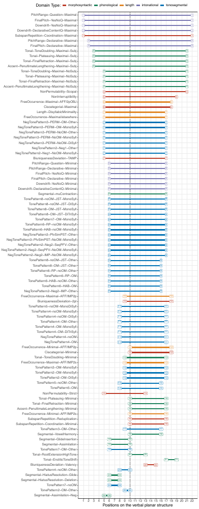

```r
plot_pooled(bundle)                                        # all tests
plot_pooled(bundle, group_by_domain = TRUE)                # rows grouped by domain type
plot_pooled(bundle, domain_types = "phonological", layers = "local")
plot_pooled(bundle, domain_types = "phonological", layers = "global")
```

| Option | Meaning |
|---|---|
| `domain_types` | `NULL` for all tests, or the types to keep. |
| `layers` | With `domain_types`: `"local"` renumbers layers for those tests alone; `"global"` keeps the numbers they have in the all-tests plot, so "layer 3" means the same thing on every chart. |
| `group_by_domain` | Group rows by domain type first (all tests only). |

Canvas: 26 cm wide (25 cm for one type); height grows with the number of
tests (0.7 cm each, at least 7 cm).

| Renderer name | Old file |
|---|---|
| `pooled_plot` | `nyan1308_pooled_plot.pdf` |
| `pooled_domainplot` | `nyan1308_pooled_domainplot.pdf` |
| `pooled_plot_<type>` | `nyan1308_pooled_plot_<type>.pdf` |
| `pooled_plot_<type>_global_layers` | `nyan1308_pooled_plot_<type>_global_layers.pdf` |

Grouped by domain type · one type, local layers · one type, global layers:

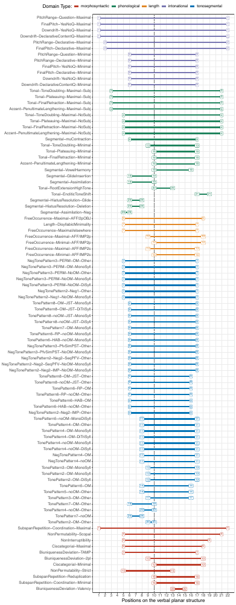
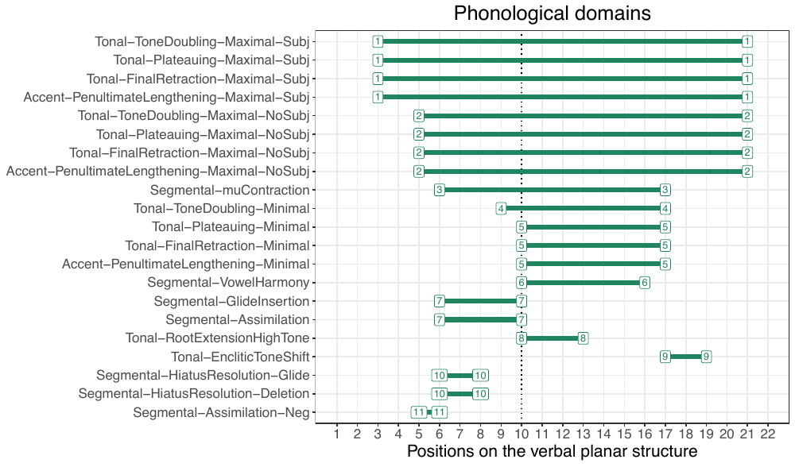
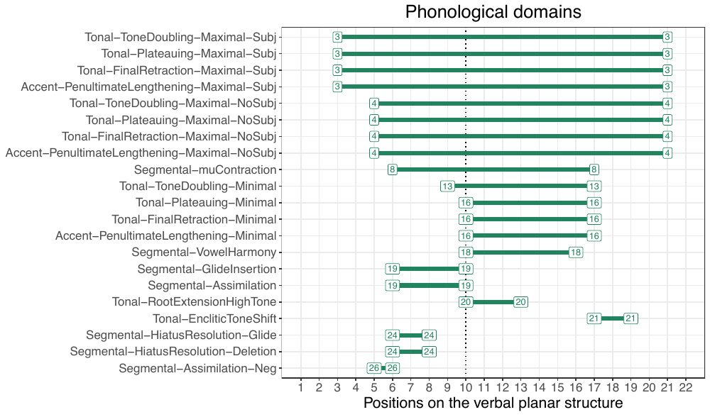

---

## 2. Boundary-frequency skyline

How often each position is the start or end of a test's span: all tests in
the top panel, then split by domain type.

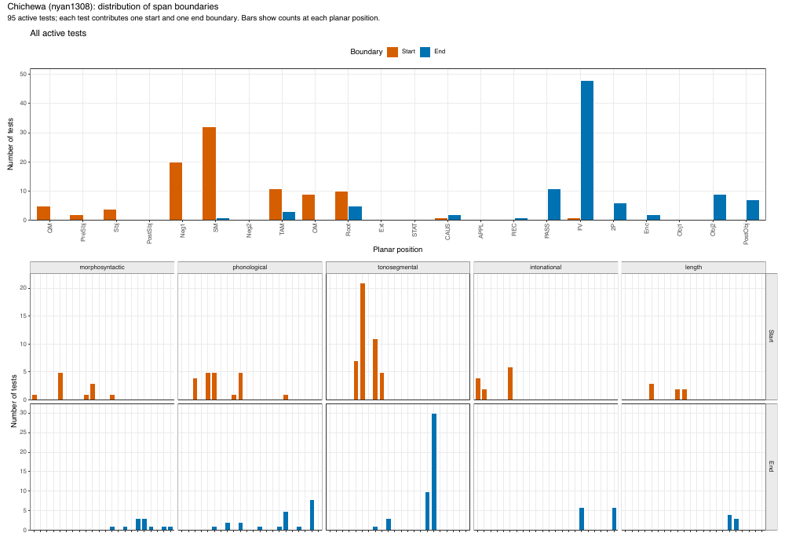

```r
plot_boundary_skyline(bundle)
```

No options. Canvas 16 × 11 in. The counts behind it are attached as
attribute `planarsviz_boundary_counts`.
Renderer name `boundary_skyline`; old file `nyan1308_boundary_skyline.pdf`.

---

## 3. Span-frequency chart

Every span except the full root as a horizontal segment, ordered by how many
maximal families contain it (fewest at the bottom); width and opacity show
that share, colour the span's main domain type.

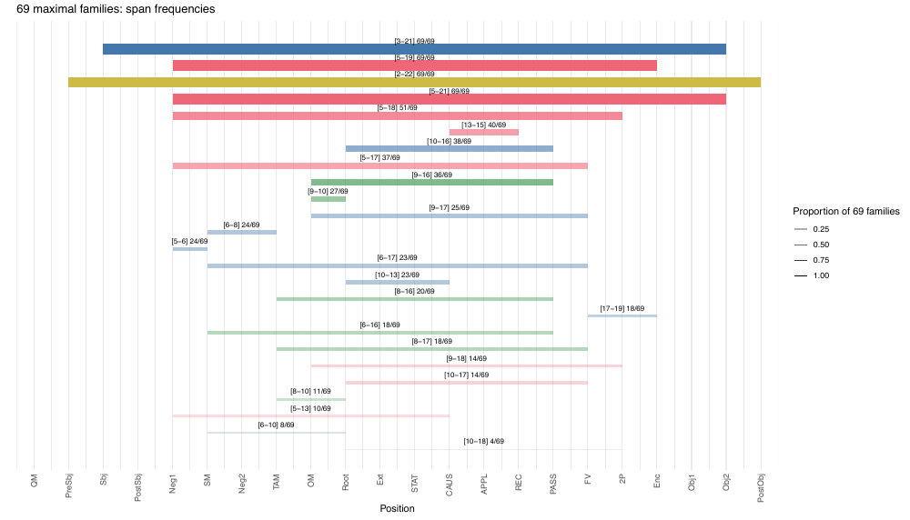

```r
plot_span_chart(bundle)
```

| Option | Meaning |
|---|---|
| `positions` | `"all"` (default) shows every position in the planar structure; `"drawn"` shows only the stretch the charted spans cover, as the old file does — which silently dropped position 1, reached only by the excluded full root. |

Canvas 14 × 8 in. Renderer name `spanchart`; old file
`nyan1308_spanchart.pdf`.

---

## 4. Per-class laminar forests

All maximal families of one domain type (or bundle of types), each drawn as
a faint tree and stacked, so structure shared by many families reads darker
and thicker.

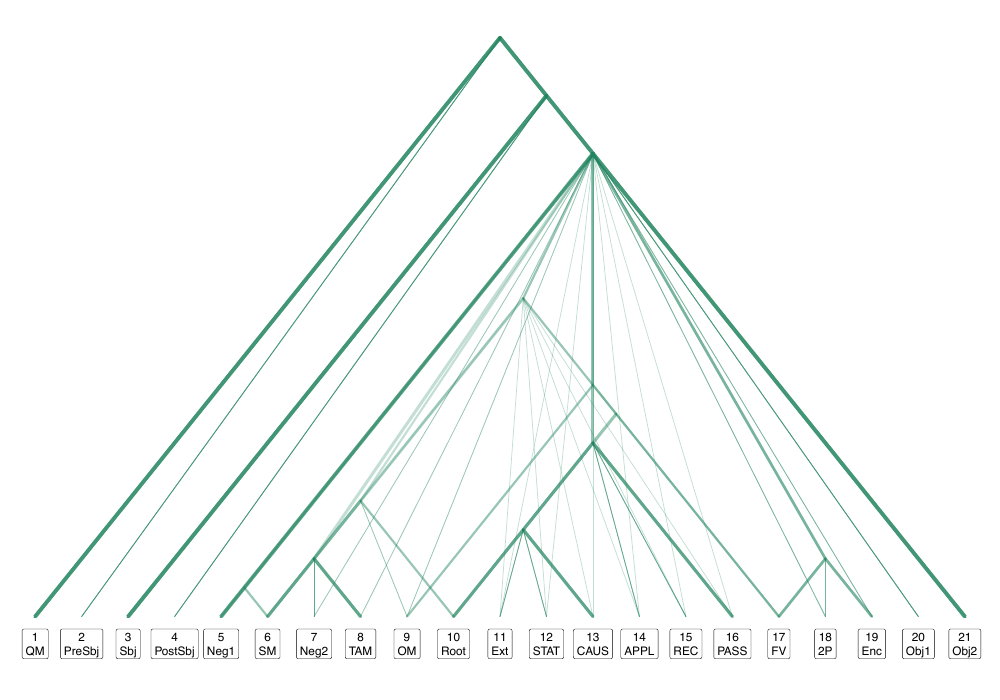

```r
plot_laminar_forest(bundle, "phon")
```

| Option | Meaning |
|---|---|
| `forest_id` | A class id from the bundle's `forests.json`: `morsyn`, `tono`, `length`, `phon`, `inton`, or a bundle `phonologylike`, `syntaxlike`, `syntaxlike_notono`. |

Canvas 20 × 14 in. Renderer name `<id>_laminar_forest`; old file
`nyan1308_<id>_laminar_forest.pdf`.

### 4a. One family of a forest, on its own

The same forest taken apart: each maximal family drawn as its own labelled
tree, rather than stacked with the rest. Drawn by the same code as the
exemplary trees below, keyed by forest and tree number instead of family id.

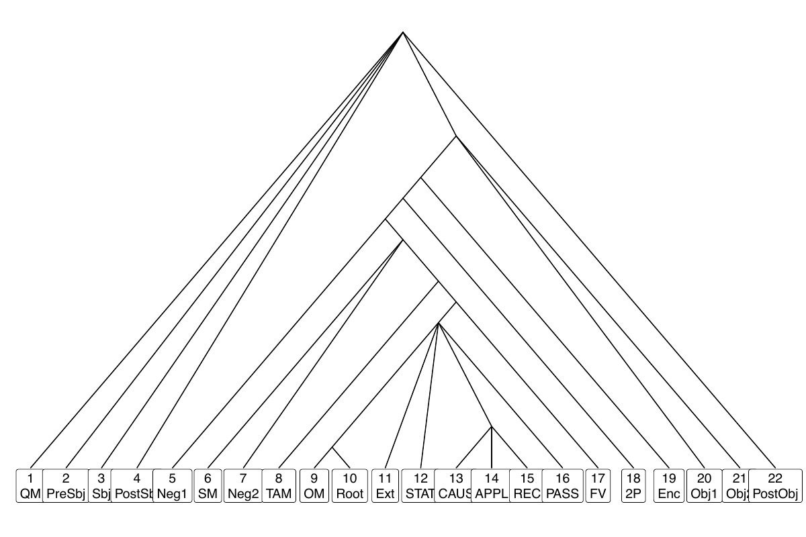

```r
plot_forest_tree(bundle, "syntaxlike", 9)
```

| Option | Meaning |
|---|---|
| `forest_id` | As above. |
| `tree_number` | Which family of that forest, as numbered in `data/forests/<forest_id>.tsv` (1 = first). |

Canvas 12 × 8 in. Renderer names `<id>_tree_<nn>`, one per tree of every
forest — 48 for nyan1308, the number padded to at least two digits. Old files
`nyan1308_phonologylike_tree_01.pdf` … `_06.pdf` and
`nyan1308_syntaxlike_tree_01.pdf` … `_16.pdf`; the other six forests' trees
had no older file, having never been drawn before the package drew them.

---

## 5. Stacked overlays

Every maximal family of one or more groups stacked in one panel: darkness
shows how many trees share a branch, thickness how many tests support the
span. One function draws the coloured domain-type overlay, the black
all-families overlay, and the version with highlighted position labels.

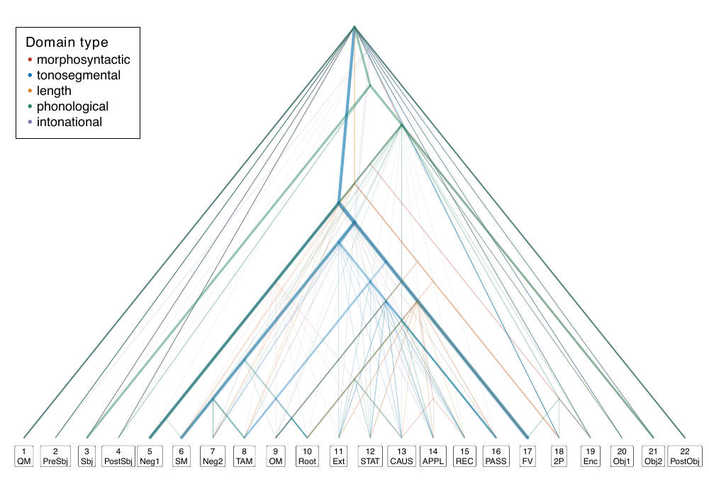

```r
plot_laminar_overlay(bundle)                                   # coloured by domain type
plot_laminar_overlay(bundle, groups = "all", alpha_divisor = 1,
                     thickness_exponent = 0.75)                # all families
plot_laminar_overlay(bundle, groups = "all", alpha_divisor = 1,
                     thickness_exponent = 0.75,
                     highlight = "orthographic_word")          # word highlighted
# add legend = TRUE to any of these for the legend version
```

| Option | Meaning |
|---|---|
| `groups` | `NULL` = every domain-type group, coloured; `"all"` = every family of the full data; or group ids from `overlay_groups.json`. |
| `alpha_divisor` | Divides each tree's opacity, `1 − 0.01^(1/trees)`. |
| `thickness_exponent` | Line thickness is convergence to this power. |
| `legend` | Add an inset legend: a colour key for several groups, a darkness/thickness key for one. |
| `highlight` | A highlight id from `highlights.tsv` to colour position labels by. |
| `legend_thickness_exponent` | Exponent for the legend's "More" thickness swatch; defaults to `thickness_exponent`, so the swatch matches the thickest lines. The old legends always used 0.5, which was too thin for the all-families charts; `0.5` reproduces them. |

Canvas 20 × 14 in.

| Renderer name | Old file |
|---|---|
| `laminar_overlay`, `laminar_overlay_legend` | `nyan1308_laminar_overlay.pdf`, `_legend.pdf` |
| `all_families_labeled`, `_legend` | `nyan1308_all_families_labeled.pdf`, `_legend.pdf` |
| `all_families_labeled_orthographic_word`, `_legend` | `nyan1308_all_families_labeled_wordhood.pdf`, `_legend.pdf` |

All families, orthographic word highlighted:

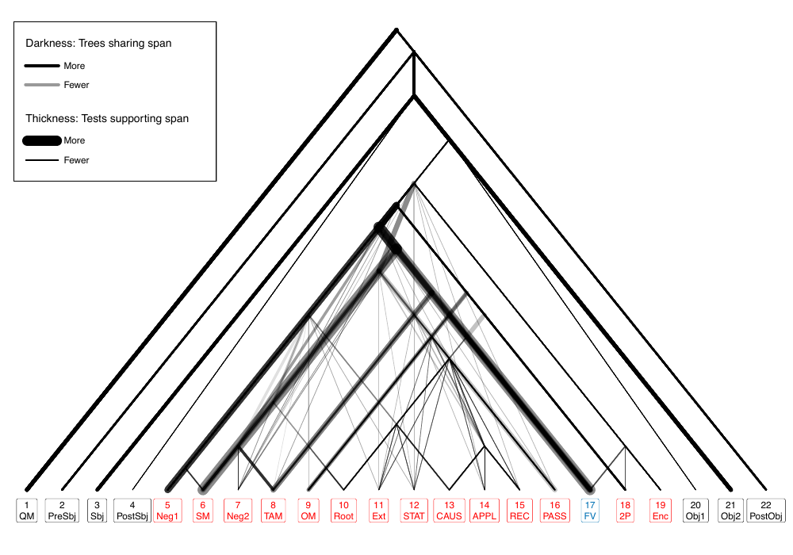

---

## 6. Frequency tree

The most consensus-like family — the one whose spans occur in the most
families overall — with each branch's opacity and thickness showing the
share of all families containing it.

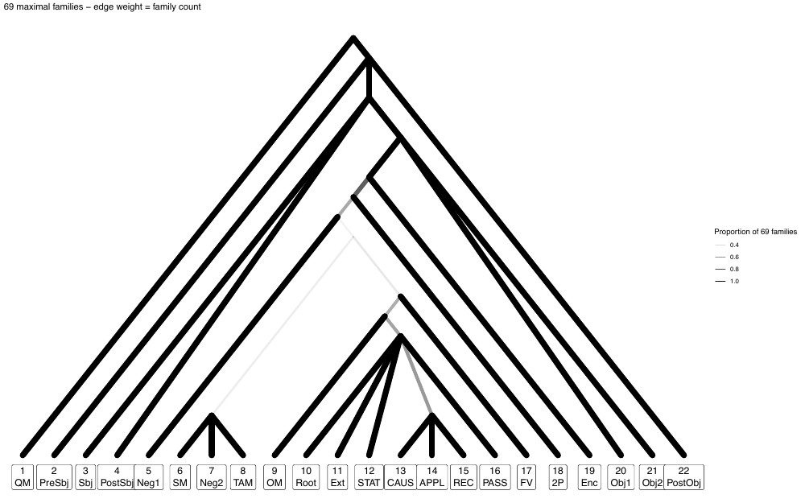

```r
plot_frequency_tree(bundle)
```

| Option | Meaning |
|---|---|
| `selection` | Which selection in `selections.tsv` to draw (default `"consensus_all"`). |
| `title` | Plot title; the default names the number of families. |
| `weight` | What branch opacity and thickness show: `"families"` (default, the share of families containing the span), `"tests"` (support relative to the best-tested span), or `"none"` (solid — shape alone). |
| `branch_size` | Thickness of a fully supported branch. Defaults to 4, the weighted charts' heaviest line; with `weight = "none"`, where every branch would be drawn at that weight, it defaults to 0.5 — ggtree's own default, matching the exemplary trees. |

Canvas 16 × 10 in. Renderer name `freqtree`; old file `nyan1308_freqtree.pdf`.

### 6a. Maximal binary branching

The same drawing used for an illustration: the family that branches most
binarily, drawn solid. Every span rests on at least one test, so this is the
most branching structure the data supports — for nyan1308, 13 nested spans
with 7 strictly binary nodes and nothing wider than four children.

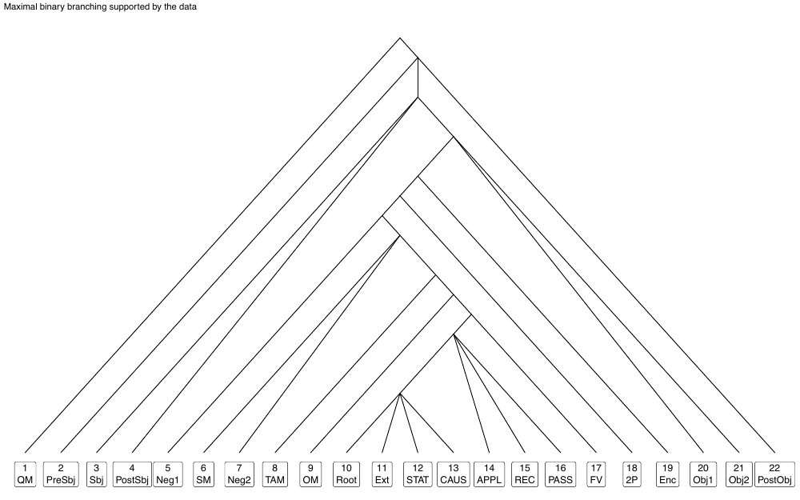

```r
plot_frequency_tree(bundle, selection = "most_binary", weight = "none",
                    title = "Maximal binary branching supported by the data")
```

Renderer name `most_binary_tree`; no old file — this chart is new. The
exporter picks the family (`most_binary` in `selections.tsv`): most strictly
binary nodes, then most tests behind the tree, then the narrowest widest
node.

A second version traces a highlight's extent — for nyan1308, the
orthographic word — with thicker edges running down to its first and last
positions:

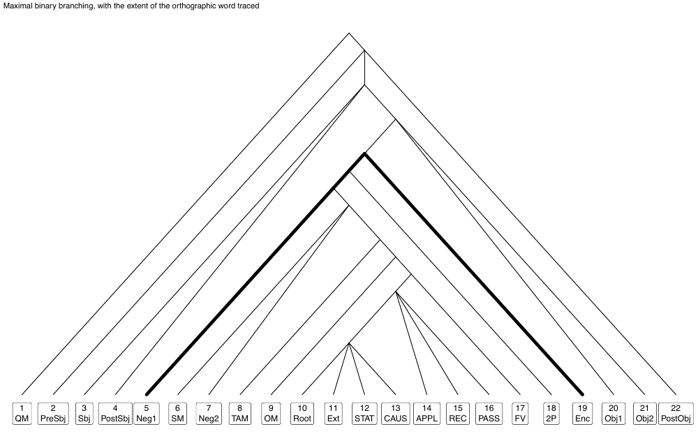

```r
plot_frequency_tree(bundle, selection = "most_binary", weight = "none",
                    emphasis = "orthographic_word")
```

| Option | Meaning |
|---|---|
| `emphasis` | A `highlight_id` from `highlights.tsv`; its first and last positions are traced. `NULL` (default) traces nothing. |
| `emphasis_size` | Thickness of the traced edges (default 2.5). |

The traced edges are those covering one of the two positions but not the
other — the path from each boundary tip up to the smallest node holding
both. Renderer name `most_binary_tree_<highlight_id>`, one per highlight in
the bundle.

---

## 7. Four trees

The most consensus-like family overall and in each conflict group, each
weighted by frequency within its group. Needs conflict groups in the bundle.

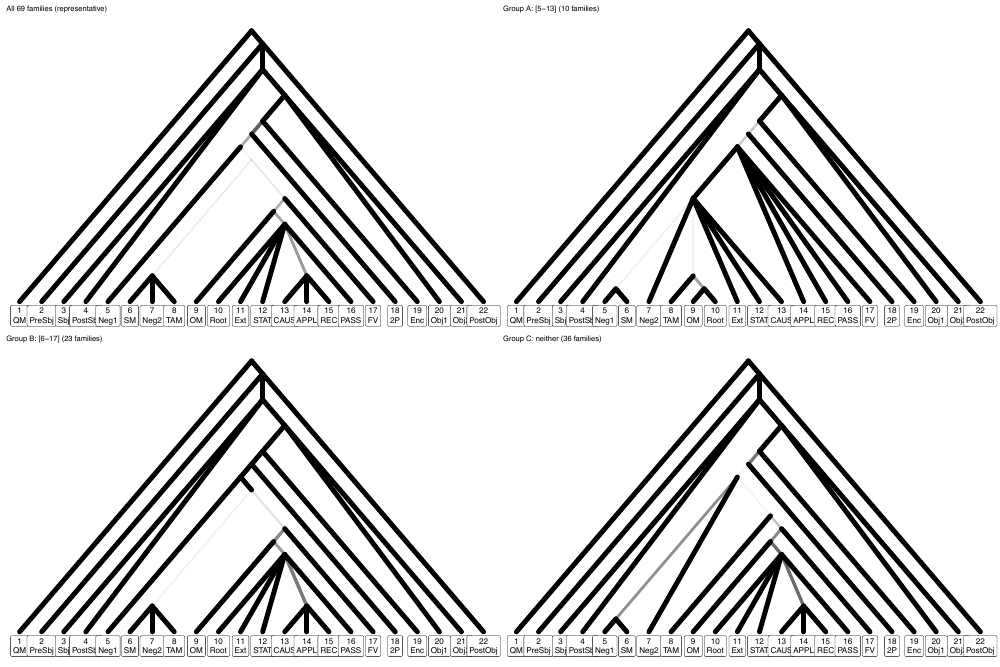

```r
plot_four_trees(bundle)
```

| Option | Meaning |
|---|---|
| `other_label` | Title text for the group of families with no defining span (default `"neither"`). |

Canvas 24 × 16 in (three groups in a 2 × 2 grid; other numbers of groups two
per row). Renderer name `four_trees`; old file `nyan1308_four_trees.pdf`.

---

## 8. Conflict groups

Every family stacked in a large panel, and below it one panel per conflict
group. Groups larger than the exporter's cap (12) show a selection chosen to
cover every span in the group.

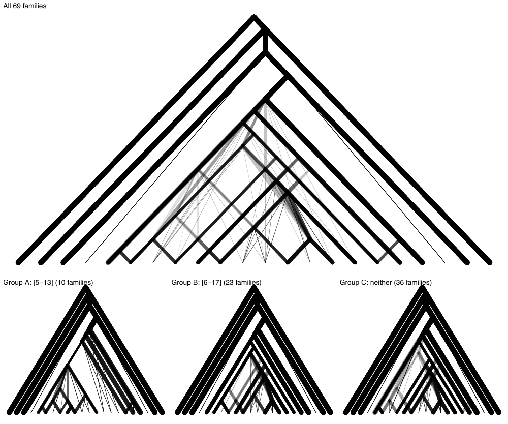

```r
plot_conflict_groups(bundle)
```

| Option | Meaning |
|---|---|
| `other_label` | As for four trees. |
| `panel_titles` | Show each panel's title (default `TRUE`). The old chart's titles never appeared; `FALSE` reproduces it. |
| `title_size` | Title size in points (default 24). |

Canvas 24 × 20 in. Renderer name `conflict_groups`; old file
`nyan1308_conflict_groups.pdf` (which has no visible titles).

---

## 9. Exemplary trees and slides

Representative families (chosen to cover the variety of spans, plus the
family with the least evidence), each drawn as a clean tree beside the
pooled plot of the tests that produced it. Layer numbers are the all-tests
plot's. Also as a pair of 16:9 slides.

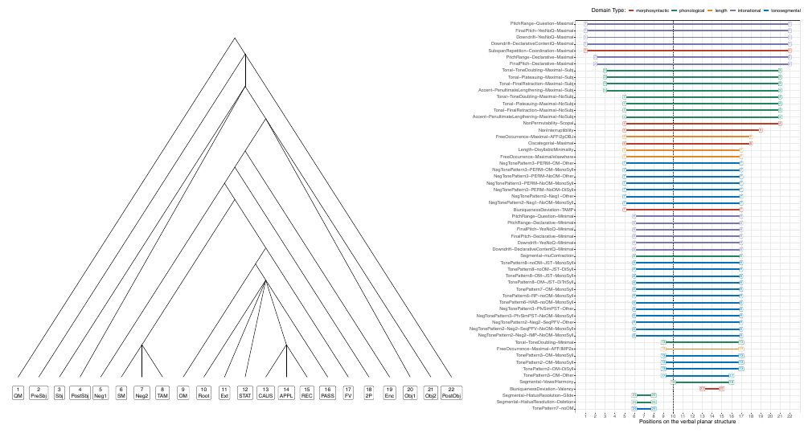

```r
plot_exemplary_tree(bundle, rank = 1)                          # print page
plot_exemplary_tree(bundle, rank = 1, view = "slide_tree")
plot_exemplary_tree(bundle, rank = 1, view = "slide_evidence")
```

| Option | Meaning |
|---|---|
| `rank` | Which selected family (1 to 7 for nyan1308). |
| `view` | `"page"`, `"slide_tree"` or `"slide_evidence"`. |
| `selection` | A selection in `selections.tsv` (default `"exemplary"`). |

Canvas: page 76 cm wide, slide tree 13.333 × 7.5 in, evidence 25 cm wide;
page and evidence heights grow with the number of tests.

| Renderer name | Old file |
|---|---|
| `exemplary_trees_<n>` | `nyan1308_exemplary_trees_<n>.pdf` |
| `exemplary_trees_slide_<n>_tree` | `nyan1308_exemplary_trees_slide_<n>_tree.pdf` |
| `exemplary_trees_slide_<n>_evidence` | `nyan1308_exemplary_trees_slide_<n>_evidence.pdf` |

Slide tree · slide evidence:

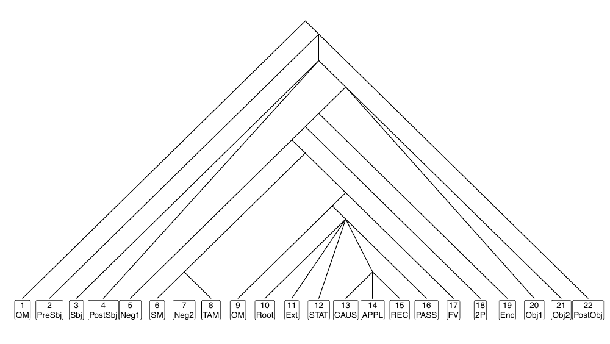
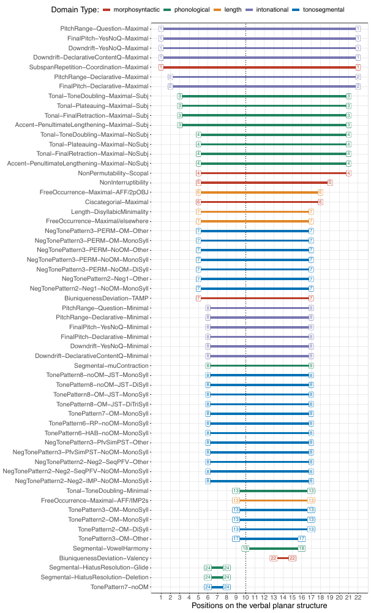

---

## 10. ForestSpans plot

One row per span, ordered by how many maximal families contain it, drawn
like a pooled plot with its layer number at both edges, in a colour blended
from its domain types, with the family count at the right.

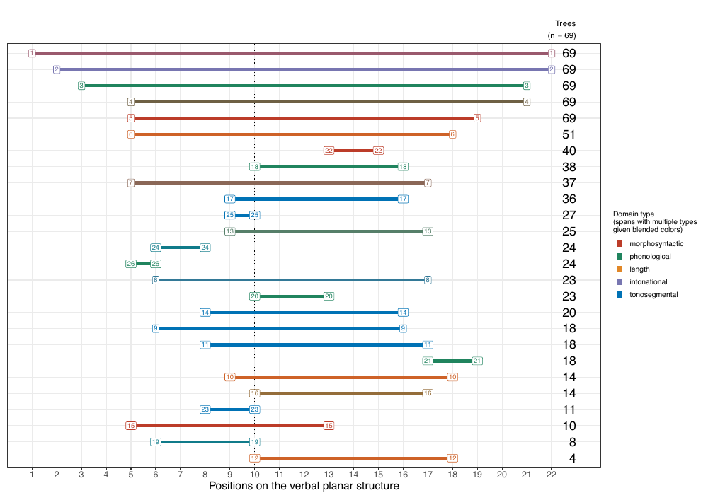

```r
plot_forestspans(bundle)
plot_forestspans(bundle, subset = "no_tono")    # fresh analysis without tonosegmental
```

| Option | Meaning |
|---|---|
| `subset` | `NULL`, or a subset id from `subsets.json`; its layers and counts are its own. |
| `legend_position` | `"inside"` (default) puts the colour key in the panel's empty lower-left corner, in a bordered white box; `"right"` puts it beside the panel, as the old file has it. |
| `legend_inside` | Where the inset legend's lower-left corner sits, as a share of the panel. |
| `count_header_size` | Sizes of the count column's header, `c(trees, n)`: "Trees" (default 6) above a smaller "(n = N)" (default 4.5). `NULL` gives the old single label, both lines at size 4. |

Canvas 34 × 24 cm. Renderer names `forestspans_plot`,
`forestspans_plot_<subset>`; old files `nyan1308_forestspans_plot.pdf`,
`_no_tono.pdf`.

---

## 11. Tree-count bar charts

How many maximal families the data allows: per domain type, per class
bundle, for all tests, and for all tests without size-2 spans. The two
horizontal charts have transparent backgrounds for slides.

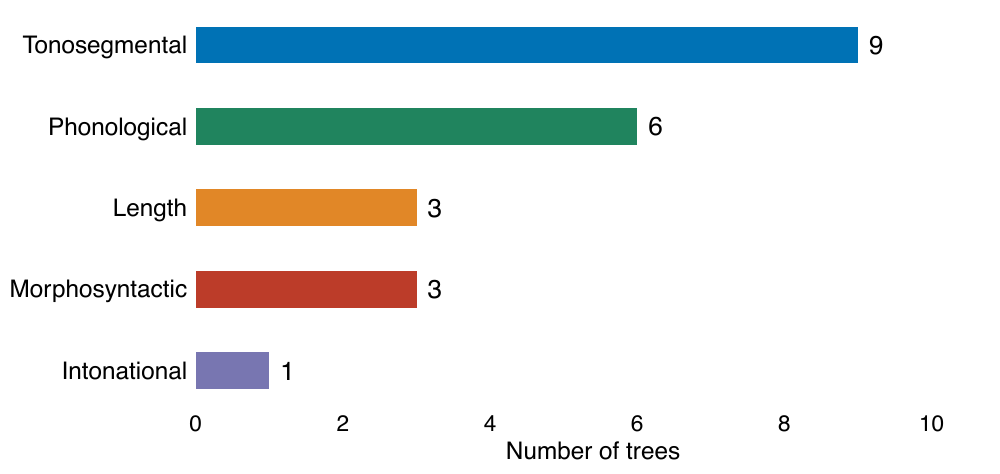

```r
plot_tree_counts(bundle, "by_class")
plot_tree_counts(bundle, "bundles")
plot_tree_counts(bundle, "all")
plot_tree_counts(bundle, "without_adjacent")
```

Canvas: 8 × 3.8 in (by class, bundles), 7 × 5 in (all), 8 × 5 in (without
adjacent). Renderer names `tree_count_<chart>`; old files
`nyan1308_tree_count_<chart>.pdf`. Ported from matplotlib: fonts differ
slightly from the old files.

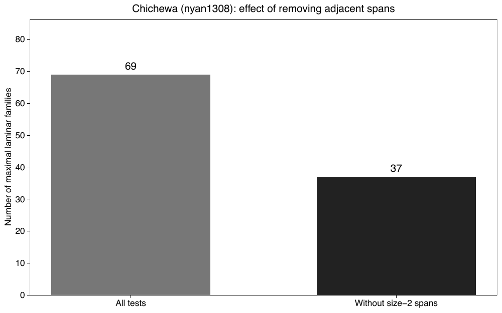

---

## 12. Boundary strength

How strongly each position is a left (top) or right (bottom) constituent
edge: bars add up each span's family count over the spans starting or ending
there; black marks count the families with at least one such span, never
above the dotted line at the family count. The distributions chart shows
the same strengths as two smoothed curves.

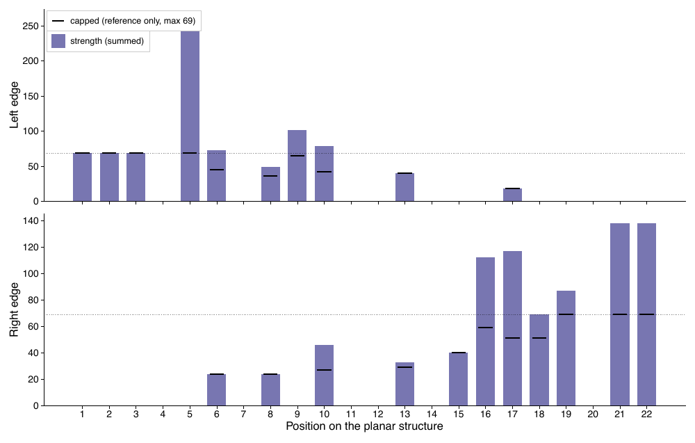

```r
plot_boundary_strength(bundle)
plot_boundary_strength(bundle, subset = "no_tono")
plot_boundary_strength_distributions(bundle)
```

| Option | Meaning |
|---|---|
| `subset` | `NULL`, or a subset id from `subsets.json`. |
| `bar_colour` | Bar colour (bars chart). |
| `colours` | Named `left` and `right` curve colours (distributions). |

Canvas 11 × 7 in (bars), 11 × 5 in (distributions). Renderer names
`boundary_strength`, `boundary_strength_<subset>`,
`boundary_strength_distributions`. Ported from matplotlib: fonts differ
slightly. The no-tonosegmental legend now gives that analysis's own family
count (24); the old file said 69.

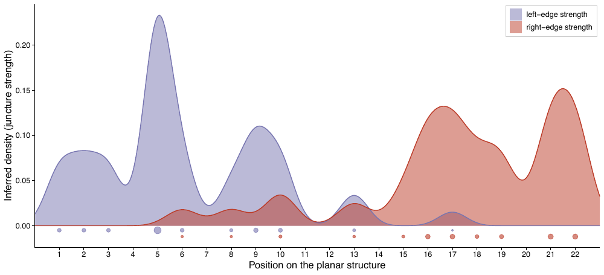

---

## 13. Boundary-strength overlay

Left and right boundary strength as paired bars over smoothed curves, with
boxed position labels coloured by a highlight.

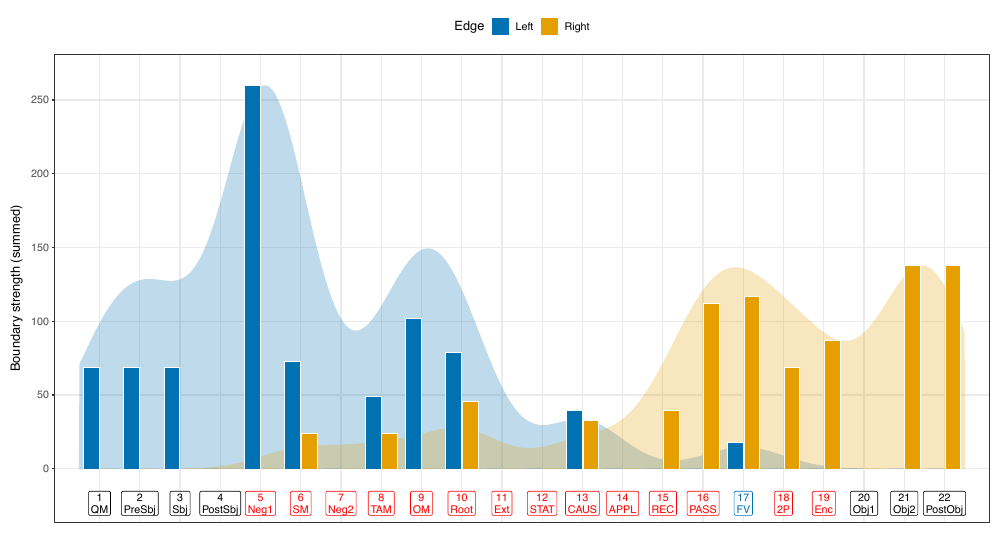

```r
plot_boundary_strength_overlay(bundle)
plot_boundary_strength_overlay(bundle, subset = "no_tono",
                               colours = c(Left = "#009E73", Right = "#CC79A7"))
```

| Option | Meaning |
|---|---|
| `subset` | `NULL`, or a subset id from `subsets.json`. |
| `colours` | Named `Left` and `Right` bar and curve colours. |
| `highlight` | Highlight id for label colours (default `"orthographic_word"`), or `NULL` for black. |

Canvas 13 × 7 in. Renderer names `boundary_strength_overlay`,
`boundary_strength_overlay_<subset>`; old files
`nyan1308_boundary_strength_overlay.pdf`, `_no_tono.pdf`.

---

## 14. Fragmentation test

Is a domain type's family count higher than its own number of tests would
predict by chance? One horizontal violin per group — the family counts under
permuted domain-type labels — with the observed count as a filled dot and the
one-sided p-value at the right. Domain types and bundles are two stacked
panels on one shared x axis, so the raw scale stays comparable.

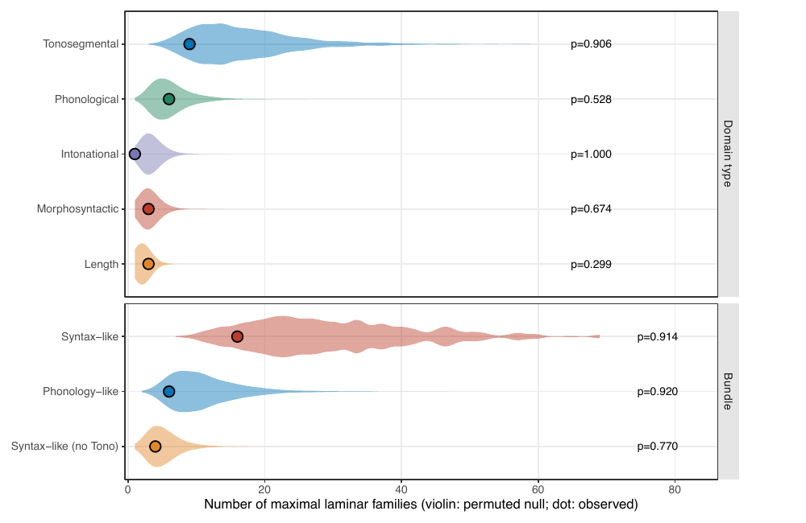

```r
plot_fragmentation_test(bundle)
```

No options: the chart draws whatever groups the bundle's table holds, in its
own colours and labels.

Canvas 10 × 6.5 in.

**This chart needs a bundle exported with `--fragmentation-permutations`.**
The permutation test takes minutes where the rest of an export takes seconds,
so the exporter only runs it on request. Without it, `plot_fragmentation_test()`
stops and says how to re-export.

| Renderer name | Old file |
|---|---|
| `fragmentation_test_plot` | `nyan1308_fragmentation_test_plot.pdf` |

Unlike every other chart here, this one was written in R from the start —
there is no matplotlib original, so the chart the standalone script drew is
itself the reference its porting check compares against.

---

## Name changes for cutover

Renderer output is `<dataset>_<renderer name>.pdf`, which equals the old
file name for every chart except:

| Old file | New file | Why |
|---|---|---|
| `nyan1308_all_families_labeled_wordhood.pdf` | `nyan1308_all_families_labeled_orthographic_word.pdf` | The name comes from the highlight id in the data. |
| `nyan1308_all_families_labeled_wordhood_legend.pdf` | `nyan1308_all_families_labeled_orthographic_word_legend.pdf` | Same. |
